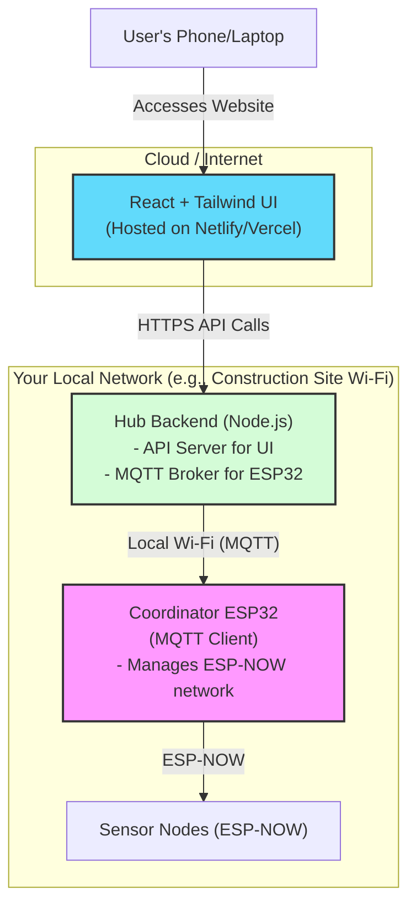

# Master Project Plan: Decoupled IoT Sensor Network

### 1. Project Goal & Core Philosophy

The primary goal is to build a scalable and user-friendly sensor network system, analogous to a "smart home app for a construction site." The system will consist of multiple sensor **Nodes** (ESP32s) that pass data along an ESP-NOW daisy chain to a central **Coordinator** (ESP32).

This project uses a **modern, decoupled, three-tier architecture**. This industry-standard approach separates the user interface from the embedded hardware, allowing for a robust, scalable, and remotely accessible system.

Our core philosophy is **building a professional MVP**. We will use modern frameworks (React, Tailwind CSS) to create a high-quality user experience, while keeping the backend and firmware logic simple and focused on core functionality.

### 2. System Architecture

The system is composed of three distinct, independent components:

1.  **Frontend Application (The UI):**
    *   A modern, single-page web application built with **React** and styled with **Tailwind CSS**.
    *   It will be hosted on a standard web hosting service (e.g., Netlify, Vercel).
    *   Users access this UI from any browser on any device (phone, laptop) with an internet connection.
    *   It communicates with the Hub Backend via a standard web API (e.g., REST over HTTPS).

2.  **Hub Backend (The Bridge):**
    *   A server application (e.g., built with **Node.js & Express**) that runs on a central computer or single-board computer like a Raspberry Pi.
    *   It acts as the central bridge between the internet-facing UI and the local embedded devices.
    *   It exposes a web API for the Frontend to call.
    *   It communicates with the Coordinator on the local network using a lightweight protocol (like MQTT or simple TCP packets).

3.  **Embedded Firmware (The Hardware):**
    *   **Coordinator (1 unit):** Its sole job is to manage the sensor network. It connects to the Hub over Wi-Fi, listens for commands (e.g., "start scan"), and sends back data. It has **no web server**.
    *   **Nodes (N units):** Simple, low-power sensor units that use ESP-NOW to forward data up the daisy chain to the Coordinator.

#### Architectural Diagram:

### 3. Technology Stack

*   **Frontend:** React, Tailwind CSS.
*   **Hub Backend:** Node.js, Express.js (or similar).
*   **Hub-Coordinator Communication:** MQTT (recommended for IoT) or a custom TCP/WebSocket protocol.
*   **Embedded:** ESP32, Arduino Framework, ESP-NOW library.

### 4. Task Breakdown (Implementation Plan)

Development will be split into three parallel streams:

1.  **M1: Hub Backend Foundation:**
    *   Set up a basic Node.js/Express server.
    *   Define placeholder API endpoints (e.g., `/api/scan`, `/api/pair`, `/api/nodes`) that return mock data.
    *   Set up an MQTT broker to communicate with the Coordinator.

2.  **M2: Frontend UI Development:**
    *   Initialize a new React project with Tailwind CSS.
    *   Build UI components for displaying nodes, pairing controls, and visualizing the chain.
    *   Connect the UI components to the Hub's mock API endpoints.
    *   This can be fully developed and tested without any hardware.

3.  **M3: Embedded Firmware:**
    *   Develop the simplified Coordinator firmware to connect to the Hub's Wi-Fi and MQTT broker. It will listen for topics (e.g., `commands/scan`) and publish to others (e.g., `data/nodes`).
    *   Develop the generic Node firmware (this remains largely unchanged from the previous plan).

4.  **M4: System Integration:**
    *   Connect the Hub Backend to the live Coordinator instead of using mock data.
    *   Test the full end-to-end flow: from a UI button click -> Hub -> Coordinator -> ESP-NOW broadcast -> Node reply -> Coordinator -> Hub -> UI update.

### 5. MVP Development Strategy

For the MVP, we will prioritize speed and core functionality:
*   **Communication:** We will use unencrypted communication (HTTP between UI-Hub, and standard MQTT between Hub-Coordinator).
*   **Authentication:** There will be no user login or authentication for the MVP.
*   **Focus:** The goal is to prove the end-to-end functionality of remote network configuration. Advanced security and features can be added later.

### 6. Success Criteria (Definition of Done)

1.  **Node Pairing:** All criteria from the previous plan (discovery, configuration, persistence, resilience) are met.
2.  **Daisy Chain:** A configured chain successfully aggregates and forwards data to the Coordinator.
3.  **Hub Connectivity:** The Coordinator successfully connects to the Hub's specified Wi-Fi network.
4.  **Data Gateway:** The Coordinator successfully transmits the aggregated data it receives from the sensor chain to a listening service on the Hub.
5.  **Full System Operation:** The entire system, from sensor reading to data reception at the Hub, works reliably after a full power cycle of all components.

### 7. Future Reach

The message format between nodes and between the Coordinator and Hub will use C `structs`. This allows for future expansion, such as adding routing information for multi-hop pairing (Solution 2) or including message timestamps and status codes, without requiring a full protocol redesign.

### 8. MVP Development Strategy & Security Posture

**Context:** This project is a Minimum Viable Product (MVP) for research purposes, not a production system. The primary goal is to rapidly prototype and validate the core functionality of the dynamic pairing and data-forwarding system.

To accelerate development and simplify debugging, several security features will be consciously deferred. The following table outlines the simplified security posture for the MVP. The full security analysis in the next section should be consulted for a future production-ready version.

| Feature | MVP Implementation (Simplified) | Deferred Features | Justification |
| :--- | :--- | :--- | :--- |
| **Config. Network** | Hard-coded WPA2 password | UI Login, AP Timeout | Sufficient for a trusted lab environment. |
| **Sensor Network** | ESP-NOW with encryption **disabled** | ESP-NOW encryption (PMK) | Avoids key management overhead during rapid iteration. |
| **Hub Communication** | Unencrypted HTTP/TCP | HTTPS or MQTT over TLS | Avoids SSL certificate management on the ESP32. |
| **Physical Security**| None | Flash Encryption, Pairing Lock | Unnecessary and counter-productive for a prototype that will be frequently reprogrammed. |

This streamlined approach allows the development team to focus entirely on the functional requirements of the system, accepting the documented and understood security risks for the duration of the research prototype's lifecycle.

### 9. Security Analysis (For Future Production)

The initial project plan prioritizes functionality. A full implementation must also address the following security vulnerabilities.

| Vulnerability | Risk Level | Mitigation |
| :--- | :--- | :--- |
| Open/Weak Configuration Wi-Fi | **Critical** | Strong WPA2 password, timeout on AP |
| Unencrypted ESP-NOW traffic | **High** | Enable ESP-NOW encryption with a shared key |
| Unencrypted Hub Communication | **High** | Use HTTPS or MQTT with TLS |
| Physical theft of Wi-Fi creds | **High** | Use ESP32 Flash Encryption (Advanced) |
| Unauthorized re-pairing of nodes | **Medium** | "Lock Configuration" feature in UI |
| No login on Web UI | **Medium** | Add a simple PIN/password to the web page |

#### Detailed Breakdown of Vulnerabilities and Mitigations:

1.  **Configuration Network & UI Security:**
    *   **Vulnerability:** The temporary Wi-Fi Access Point is a single point of failure. If an attacker gains access, they have administrative control over the entire sensor network configuration.
    *   **Mitigation:**
        *   **Strong Authentication:** The AP must be protected with a strong WPA2 password.
        *   **Limited Exposure Window:** The AP should automatically time out and shut down after a period of inactivity (e.g., 10 minutes). A physical button press on the Coordinator should be required to re-enable it.
        *   **UI Login:** A simple PIN or password should be required to access the web UI itself, providing a second layer of defense.

2.  **ESP-NOW Communication Security:**
    *   **Vulnerability:** Without encryption, sensor data can be easily sniffed (eavesdropping) and malicious configuration or data packets can be injected (spoofing).
    *   **Mitigation:**
        *   **Enable ESP-NOW Encryption:** `peerInfo.encrypt` must be set to `true`. All devices (Coordinator and Nodes) must be programmed with the same secret 16-byte Primary Master Key (PMK).

3.  **Hub Communication Security:**
    *   **Vulnerability:** If the Coordinator sends data to the Hub over an unencrypted channel (e.g., plain HTTP), anyone on the main Wi-Fi network can intercept all aggregated sensor data.
    *   **Mitigation:**
        *   **Use Encrypted Protocols:** Communication must use a secure transport layer like **HTTPS** or **MQTT with TLS**.

4.  **Physical Security & Device Integrity:**
    *   **Vulnerability:** An attacker with physical access can compromise a device, potentially stealing the Hub's Wi-Fi credentials from the Coordinator's memory or hijacking a Node.
    *   **Mitigation:**
        *   **Secure Storage (Advanced):** Use the ESP32's **Flash Encryption** feature. This is a one-time, irreversible operation that encrypts the device's entire flash memory.
        *   **Pairing Lock:** The UI should have a "Lock Configuration" button that disables the discovery and pairing process on the Coordinator until it is physically unlocked. 